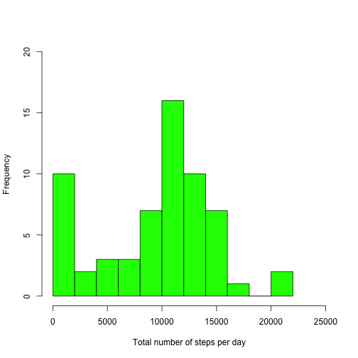
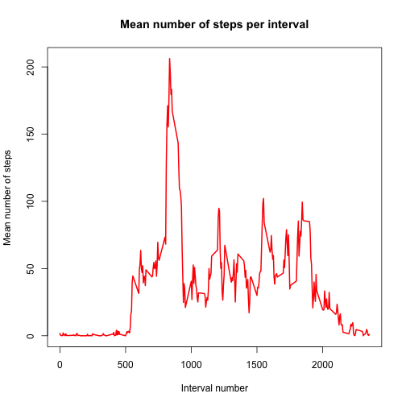
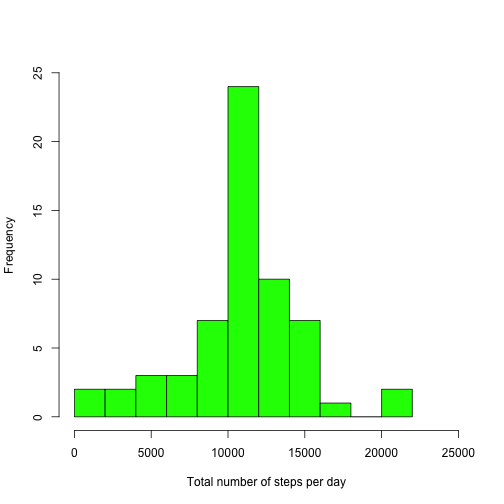
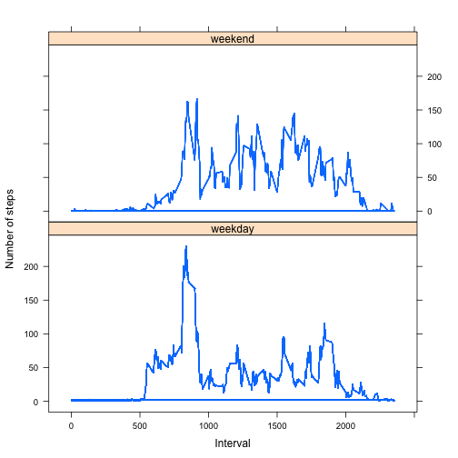

# Reproducible Research: Peer Assessment 1


## Loading and preprocessing the data

### 1. Load the activity data set

```r
library(knitr)
activity <- read.csv(file = "activity.csv")
str(activity)
```

```
## 'data.frame':	17568 obs. of  3 variables:
##  $ steps   : int  NA NA NA NA NA NA NA NA NA NA ...
##  $ date    : Factor w/ 61 levels "2012-10-01","2012-10-02",..: 1 1 1 1 1 1 1 1 1 1 ...
##  $ interval: int  0 5 10 15 20 25 30 35 40 45 ...
```

The data frame does not need to be further processed at this point.
## What is the mean total number of steps taken per day?

### 1. Make a histogram of the total number of steps taken each day

```r
hist(tapply(activity$steps, activity$date, sum, na.rm = TRUE), main = "", xlab = "Total number of steps per day", 
    breaks = 10, ylim = c(0, 20), xlim = c(0, 25000), col = "green")
```

 


### 2. Calculate and report the mean and median total number of steps taken per day

```r
Total.steps <- tapply(activity$steps, activity$date, sum, na.rm = TRUE)
Mean <- round(mean(Total.steps), digits = 0)
Median <- median(Total.steps)
# The mean number of total steps per day is `r Mean`.  The median number of
# total steps per day is `r Median`.
```

#### The mean number of total steps per day is 9354.  
#### The median number of total steps per day is 10395.  


## What is the average daily activity pattern?

### 1. Make a time series plot of the 5-minute interval and the average number of steps taken, averaged across all days

```r
Interval.mean <- (tapply(activity$steps, as.factor(activity$interval), mean, 
    na.rm = TRUE))
plot(as.numeric(names(Interval.mean)), as.numeric(Interval.mean), type = "l", 
    lwd = 2, col = "red", main = "Mean number of steps per interval", xlab = "Interval number", 
    ylab = "Mean number of steps")
```

 


### 2. Which 5-minute interval, on average across all the days in the dataset, contains the maximum number of steps?

```r
Max.Interval <- Interval.mean[Interval.mean == max(Interval.mean)]
Interval.Name <- names(Max.Interval)
Max.Value <- round(as.numeric(Max.Interval), digits = 0)
# The 5-minute interval with the maximum number of average steps is interval
# number `r Interval.Name` with `r Max.Value` steps.
```

#### The 5-minute interval with the maximum number of average steps is interval number 835 with 206 steps.


## Imputing missing values

### 1. Calculate and report the total number of missing values in the dataset (i.e. the total number of rows with NAs)

```r
sum(is.na(activity))
```

```
## [1] 2304
```

#### Double-check to make sure that there are no rows with more than 1 NA:  
#### Total number of rows minus number of complete rows = number of rows with NA.

```r
dim(activity)[1] - sum(complete.cases(activity))
```

```
## [1] 2304
```

#### Overall, there are 2304 missing values in the dataset.


### 2. Devise a strategy for filling in all of the missing values in the dataset. 

#### Impute missing values with the mean number of steps for the corresponding 5-minute interval:

```r
missing <- is.na(activity$steps)  #identify rows with missing values
```


### 3. Create a new dataset that is equal to the original dataset but with the missing data filled in.

```r
new.activity <- activity
new.activity$steps[missing] <- as.numeric(Interval.mean)  # insert mean number of steps 
sum(is.na(new.activity))
```

```
## [1] 0
```


### 4. Make a histogram of the total number of steps taken each day and calculate and report the mean and median total number of steps taken per day. Do these values differ from the estimates from the first part of the assignment? What is the impact of imputing missing data on the estimates of the total daily number of steps?

#### a) Histogram for the new complete data set:

```r
hist(tapply(new.activity$steps, new.activity$date, sum), main = "", xlab = "Total number of steps per day", 
    breaks = 10, ylim = c(0, 25), xlim = c(0, 25000), col = "green")
```

 


#### b) Mean and median total number of steps taken per day for the new data set:

```r
Total.steps2 <- tapply(new.activity$steps, new.activity$date, sum)
Mean2 <- round(mean(Total.steps2), digits = 0)
Mean2
```

```
## [1] 10766
```

```r
Median2 <- median(Total.steps2)
Median2
```

```
## [1] 10766
```

#### After replacing missing values with the mean number of steps for the corresponding 5-min interval the histogram is closer to a normal distribution and the mean and median total number of steps per day are both identical (10766) and higher than prior to imputation of missing values. 


## Are there differences in activity patterns between weekdays and weekends?

### 1. Create a new factor variable in the dataset with two levels – “weekday” and “weekend” indicating whether a given date is a weekday or weekend day.

#### a) Format the date column and create a new column with names of the days:

```r
new.activity$date <- as.Date(new.activity$date)  #format the date column
Days <- weekdays(new.activity$date)  # determine the day of the week for each date
new.activity$Day <- Days  # create a new column with the names of the days
```


#### b) Create the factor variable:

```r
weekday <- new.activity$Day %in% c("Monday", "Tuesday", "Wednesday", "Thursday", 
    "Friday")
weekend <- new.activity$Day %in% c("Saturday", "Sunday")

new.activity$Day[weekday] <- "weekday"
new.activity$Day[weekend] <- "weekend"

new.activity$Day <- as.factor(new.activity$Day)
str(new.activity)
```

```
## 'data.frame':	17568 obs. of  4 variables:
##  $ steps   : num  1.717 0.3396 0.1321 0.1509 0.0755 ...
##  $ date    : Date, format: "2012-10-01" "2012-10-01" ...
##  $ interval: int  0 5 10 15 20 25 30 35 40 45 ...
##  $ Day     : Factor w/ 2 levels "weekday","weekend": 1 1 1 1 1 1 1 1 1 1 ...
```


### 2. Make a panel plot containing a time series plot of the 5-minute interval and the average number of steps taken, averaged across all weekday days or weekend days. 

#### a) Calculate the average number of steps for weekdays or weekend days

```r
WD.Interval.mean <- (tapply(new.activity$steps[new.activity$Day == "weekday"], 
    as.factor(new.activity$interval[new.activity$Day == "weekday"]), mean))
new.activity$meansteps[new.activity$Day == "weekday"] <- WD.Interval.mean

WE.Interval.mean <- (tapply(new.activity$steps[new.activity$Day == "weekend"], 
    as.factor(new.activity$interval[new.activity$Day == "weekend"]), mean))
new.activity$meansteps[new.activity$Day == "weekend"] <- WE.Interval.mean
```

#### b) Panel plot with the average number of steps per interval for weekends and weekdays:

```r
library(lattice)
xyplot(meansteps ~ interval | Day, data = new.activity, type = "l", xlab = "Interval", 
    ylab = "Number of steps", layout = c(1, 2))
```

 


